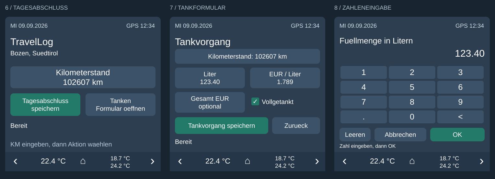

# TravelLog im bestehenden 480 × 480 Fahrerhaus-Display

Für ESP32-S3-4848S040 (16 MB), openHASP und TravelLog ab Version 0.2.0.
Die Erweiterung passt zur gelieferten Belegung mit Seiten 1–5, Kopfzeile auf
Seite 0 und Navigation ab y=420. Bestehende Objekte werden nicht ersetzt.

Die Vorschau zeigt die neuen Bedienflächen schematisch. Kopf-/Fußzeile stehen
stellvertretend für die bereits vorhandenen globalen Objekte; echte Schrift-
und Checkboxgrößen hängen von der Display-Firmware ab.

## Seiten

| Seite | Funktion |
| --- | --- |
| 6 | TravelLog: Tagesziel, KM-Eingabe, Tagesabschluss speichern, Tankformular öffnen |
| 7 | Tankformular: KM, Liter, Literpreis, Gesamtpreis, Vollgetankt-Checkbox |
| 8 | Gemeinsame Zahlentastatur mit Dezimalpunkt, Rücktaste, Leeren, Abbrechen und OK |

Der Hauptumlauf ist **1 → 2 → 3 → 4 → 5 → 6 → 1**. Seite 7 öffnet sich über
„Tanken“, Seite 8 durch Antippen eines Eingabefelds. „Abbrechen“ verwirft die
noch nicht bestätigte Zahl. „OK“ übernimmt sie ins Formular und kehrt zur
passenden Formularseite zurück. Die vorhandenen globalen Pfeile bleiben aktiv;
auf den Unterseiten führen sie zurück zur Übersicht, ohne zu speichern.

## Einbau

1. `travellog-pages.jsonl` **am Ende** deiner bestehenden Displaydatei anhängen.
   Die ersten beiden Zeilen überschreiben nur `prev` von Seite 1 und `next` von
   Seite 5, danach werden Seiten 6–8 ergänzt. Die alten Seiten nicht löschen.
   Stelle sicher, dass die Firmware mindestens Seiten 0–8 unterstützt.
2. `package.yaml` nach `/config/packages/travellog_480.yaml` kopieren. Falls noch
   nicht vorhanden, im bestehenden `homeassistant:`-Block der `configuration.yaml`
   ergänzen: `packages: !include_dir_named packages`.
3. Im Paket die Variable **`plate: openhasp.terminal01`** prüfen. Dies ist eine
   Annahme aus den vorhandenen Dateinamen, keine bestätigte Entitäts-ID.
   Durch die tatsächliche HA-Entitäts-ID des Displays ersetzen.
4. Den Inhalt von `objects.yaml` an die bereits vorhandene **`objects:`-Liste
   dieses Displays** anhängen. Keinen zweiten gleichnamigen `openhasp:`- oder
   Plate-Block erzeugen. Das Paket definiert bewusst keinen solchen Block.
5. `location_entity` im Paket und die Ortsanzeige `p6b2` in `objects.yaml` zeigen
   auf `sensor.nx_01_position_gps_location`. Beide bei Bedarf gemeinsam ändern.
   Bei mehreren TravelLog-Instanzen außerdem `travel_entry` im Paket setzen.
6. Home-Assistant-Konfiguration prüfen, HA neu starten und die erweiterte
   Displaydatei laden. Falls HA die Displaydatei verwaltet, deren vollständigen
   Pfad in der bestehenden openHASP-Konfiguration beibehalten/aktualisieren.
   Nach Änderungen die openHASP-Integration neu laden.

Die mitgelieferten alten 320 × 480 Beispiele sind **nicht zusätzlich nötig**.
Falls deren Package bereits installiert ist, kann es entfernt werden, sofern es
nicht noch von einem anderen Display genutzt wird. Die 480er-Helfer haben eigene
IDs und überschreiben weder bestehende Display-Zuordnungen noch die Tankfelder
der TravelLog-Integration.

## Bedienung

- **Tagesabschluss:** aktuellen KM-Stand eingeben, angezeigten Ort prüfen,
  „Tagesabschluss speichern“ drücken. Gesendet werden `odometer_km`,
  `log_type: day_end` und der Ort als `vendor`.
- **Tanken:** KM-Stand übernehmen oder bearbeiten; Liter, Literpreis und
  Gesamtpreis können einzeln leer bleiben. Alle Preise sind in EUR.
  Vollgetankt ankreuzen, falls zutreffend, und „Tankvorgang speichern“ drücken.
- Die Zahlentastatur erlaubt 1 Nachkommastelle für KM, 2 für Liter und
  Gesamtpreis sowie 3 für den Literpreis. Die Höchstwerte entsprechen der
  Integration. Optionales Feld leeren: antippen → Leeren → OK.
- Leere Tankfelder werden nicht übertragen; `0` ist eine ausdrücklich
  eingegebene Null. Fehlende Preise/Beträge berechnet TravelLog, soweit möglich.
- Erst eine bestätigte API-Antwort erzeugt die Anzeige „Gespeichert #…“.
  „WebApp ergänzen“ bedeutet erfolgreich gespeichert mit Nachbearbeitungsbedarf.
  Nach Erfolg wird der KM-Puffer geleert, beim Tanken auch das Tankformular.
- Bei Fehler/unklarem Ergebnis bleiben die Werte stehen. **Zuerst in der WebApp
  prüfen**, ob der Eintrag gespeichert wurde. Weitere Speichertastendrücke werden
  blockiert. Für einen bewusst neuen Versuch muss der KM-Wert erneut mit OK
  bestätigt werden. Diese Sperre schützt auch vor während des Speicherns
  eingereihten Doppelklicks.
- Nach einem HA-Neustart starten die Displayeingaben leer. Es gibt keine
  Offline-Warteschlange für Bordbucheinträge.

Die Displaydaten sind ein eigener Entwurf. Sie werden atomar über
`travellog.add_logbook_entry` gesendet; es werden keine fremden HA-Tankfelder
geleert. Der im Paket gewählte Ortssensor gilt für dieses Display unabhängig
von der Sensorauswahl für den normalen Day-end-Button.

## Vor-Ort-Prüfung

1. Seitenumlauf prüfen; bestehende Seiten, Alarmanzeige und Navigation testen.
2. KM und `123.40` Liter eingeben, mit Rücktaste/Leeren korrigieren und Abbrechen
   testen. Die Checkbox muss mit dem HA-Helfer synchron bleiben.
3. Bei den ersten gewünschten realen Einträgen Daten in der WebApp vergleichen.
   Es wurden während der Entwicklung keine echten Bordbucheinträge erstellt.
4. Bei unklarer Rückmeldung niemals blind erneut speichern.

Die YAML-Steuerung wird mit echten HA-Helfern und nachgebildeten externen
Services getestet. Ein Hardwaretest auf deinem Display ist dadurch nicht ersetzt.
Die Tastenmatrix verwendet `up` mit `text`; die Checkbox verwendet `on`/`off`.
Falls deine Firmware andere Ereignisse liefert, die tatsächlichen MQTT-Ereignisse
prüfen und die Bindungen anpassen.

In der gelieferten Altdatei waren fünf unquotierte `swipe`-Schlüssel enthalten.
Für die lokal zusammengeführte Datei wurden sie zu `"swipe"` normalisiert;
die übrigen bestehenden Objekte, Bildpfade und IDs wurden beibehalten.
